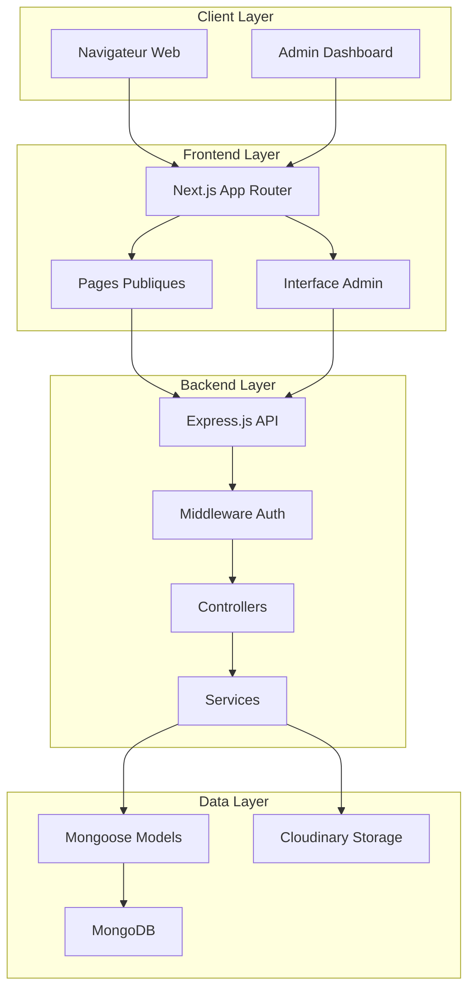

# Document de Conception - Plateforme ÉBENOR CRÉATION

## Vue d'Ensemble

La plateforme ÉBENOR CRÉATION est une solution web complète pour une usine de fabrication de bois haut de gamme en Tunisie. Le système comprend un site vitrine moderne avec un panneau d'administration intégré, permettant la gestion dynamique du contenu sans intervention technique.

### Objectifs Techniques

- **Performance**: Temps de chargement < 3 secondes, API responsive < 500ms
- **Sécurité**: Authentification JWT, validation des données, protection des routes
- **Scalabilité**: Architecture modulaire, containerisation Docker
- **Maintenabilité**: Code structuré, documentation complète, tests automatisés
- **Expérience Utilisateur**: Design luxueux, interface intuitive, responsive design

### Technologies Principales

- **Frontend**: Next.js 14 avec App Router, Tailwind CSS, TypeScript
- **Backend**: Express.js, Node.js, JWT, Multer/Cloudinary
- **Base de Données**: MongoDB avec Mongoose ODM
- **Déploiement**: Docker, variables d'environnement
- **Outils**: ESLint, Prettier, Jest pour les tests

## Architecture

### Architecture Globale



### Structure des Répertoires

```
Ebenor-Creation/
├── frontend/                 # Application Next.js
│   ├── src/
│   │   ├── app/             # App Router pages
│   │   │   ├── (public)/    # Pages publiques
│   │   │   ├── admin/       # Pages admin
│   │   │   └── api/         # API routes (proxy)
│   │   ├── components/      # Composants réutilisables
│   │   │   ├── ui/          # Composants UI de base
│   │   │   ├── public/      # Composants publics
│   │   │   └── admin/       # Composants admin
│   │   ├── lib/             # Utilitaires et configurations
│   │   ├── hooks/           # Custom hooks React
│   │   └── types/           # Types TypeScript
│   ├── public/              # Assets statiques
│   └── package.json
├── backend/                  # API Express.js
│   ├── src/
│   │   ├── controllers/     # Contrôleurs API
│   │   ├── models/          # Modèles Mongoose
│   │   ├── routes/          # Définition des routes
│   │   ├── middleware/      # Middlewares personnalisés
│   │   ├── services/        # Logique métier
│   │   ├── utils/           # Utilitaires
│   │   └── config/          # Configuration
│   ├── tests/               # Tests automatisés
│   └── package.json
├── docker-compose.yml        # Configuration Docker
├── .env.example             # Variables d'environnement
└── README.md
```

### Flux de Données

1. **Requête Publique**: Visiteur → Next.js → Express API → MongoDB → Réponse
2. **Authentification Admin**: Admin → Login → JWT Token → Routes Protégées
3. **Gestion Contenu**: Admin → Interface → API → Validation → Base de Données
4. **Upload Média**: Admin → Multer → Cloudinary → URL → Base de Données

## Composants et Interfaces

### Composants Frontend

#### Composants Publics

```typescript
// components/public/Hero.tsx
interface HeroProps {
  title: string;
  subtitle: string;
  backgroundImage: string;
  ctaText: string;
  ctaLink: string;
}

// components/public/ProductCard.tsx
interface ProductCardProps {
  id: string;
  name: string;
  description: string;
  images: string[];
  category: string;
  price?: number;
}

// components/public/GalleryGrid.tsx
interface GalleryGridProps {
  images: GalleryImage[];
  categories: string[];
  onCategoryFilter: (category: string) => void;
}

// components/public/ContactForm.tsx
interface ContactFormProps {
  onSubmit: (data: ContactFormData) => Promise<void>;
  isLoading: boolean;
}
```

#### Composants Admin

```typescript
// components/admin/ContentEditor.tsx
interface ContentEditorProps {
  content: HomeContent;
  onSave: (content: HomeContent) => Promise<void>;
  isLoading: boolean;
}

// components/admin/ProductManager.tsx
interface ProductManagerProps {
  products: Product[];
  onAdd: (product: Omit<Product, 'id'>) => Promise<void>;
  onEdit: (id: string, product: Partial<Product>) => Promise<void>;
  onDelete: (id: string) => Promise<void>;
}

// components/admin/MediaUploader.tsx
interface MediaUploaderProps {
  onUpload: (files: File[]) => Promise<string[]>;
  acceptedTypes: string[];
  maxSize: number;
  multiple?: boolean;
}
```

### Interfaces API

#### Endpoints Publics

```typescript
// GET /api/home
interface HomeResponse {
  hero: HeroSection;
  about: AboutSection;
  services: ServiceSection[];
  testimonials: Testimonial[];
}

// GET /api/products
interface ProductsResponse {
  products: Product[];
  categories: string[];
  total: number;
  page: number;
  limit: number;
}

// GET /api/gallery
interface GalleryResponse {
  images: GalleryImage[];
  categories: string[];
}

// POST /api/messages
interface MessageRequest {
  name: string;
  email: string;
  phone?: string;
  subject: string;
  message: string;
}
```

#### Endpoints Admin

```typescript
// POST /api/auth/login
interface LoginRequest {
  email: string;
  password: string;
}

interface LoginResponse {
  token: string;
  user: AdminUser;
  expiresIn: number;
}

// PUT /api/admin/home
interface UpdateHomeRequest {
  hero?: Partial<HeroSection>;
  about?: Partial<AboutSection>;
  services?: ServiceSection[];
}

// POST /api/admin/products
interface CreateProductRequest {
  name: string;
  description: string;
  category: string;
  images: string[];
  specifications?: Record<string, string>;
  price?: number;
}
```

### Services et Utilitaires

```typescript
// services/api.ts
class ApiService {
  private baseURL: string;
  private token?: string;

  async get<T>(endpoint: string): Promise<T>;
  async post<T>(endpoint: string, data: any): Promise<T>;
  async put<T>(endpoint: string, data: any): Promise<T>;
  async delete<T>(endpoint: string): Promise<T>;
  setAuthToken(token: string): void;
}

// services/upload.ts
class UploadService {
  async uploadImages(files: File[]): Promise<string[]>;
  async deleteImage(url: string): Promise<void>;
  validateImageFile(file: File): boolean;
}

// utils/validation.ts
export const validateEmail = (email: string): boolean;
export const validatePhone = (phone: string): boolean;
export const sanitizeInput = (input: string): string;
```

## Modèles de Données

### Schémas MongoDB avec Mongoose

#### Modèle Home (Contenu Dynamique)

```typescript
interface HomeContent {
  _id: ObjectId;
  hero: {
    title: string;
    subtitle: string;
    backgroundImage: string;
    ctaText: string;
    ctaLink: string;
  };
  about: {
    title: string;
    description: string;
    image: string;
    highlights: string[];
  };
  services: Array<{
    title: string;
    description: string;
    icon: string;
    image: string;
  }>;
  process: Array<{
    step: number;
    title: string;
    description: string;
    image: string;
  }>;
  testimonials: Array<{
    name: string;
    company: string;
    text: string;
    rating: number;
    image?: string;
  }>;
  contact: {
    address: string;
    phone: string;
    email: string;
    whatsapp: string;
    workingHours: string;
  };
  updatedAt: Date;
  updatedBy: ObjectId;
}
```

#### Modèle Product

```typescript
interface Product {
  _id: ObjectId;
  name: string;
  slug: string;
  description: string;
  shortDescription: string;
  category: string;
  subcategory?: string;
  images: Array<{
    url: string;
    alt: string;
    isPrimary: boolean;
  }>;
  specifications: Record<string, string>;
  dimensions?: {
    length?: number;
    width?: number;
    height?: number;
    unit: 'cm' | 'm';
  };
  materials: string[];
  finishes: string[];
  price?: {
    amount: number;
    currency: string;
    unit?: string; // 'm²', 'pièce', etc.
  };
  availability: 'in_stock' | 'made_to_order' | 'out_of_stock';
  featured: boolean;
  seoTitle?: string;
  seoDescription?: string;
  tags: string[];
  createdAt: Date;
  updatedAt: Date;
  createdBy: ObjectId;
}
```

#### Modèle Gallery

```typescript
interface GalleryImage {
  _id: ObjectId;
  title: string;
  description?: string;
  url: string;
  thumbnailUrl: string;
  category: string;
  tags: string[];
  alt: string;
  dimensions: {
    width: number;
    height: number;
  };
  fileSize: number;
  mimeType: string;
  featured: boolean;
  sortOrder: number;
  uploadedAt: Date;
  uploadedBy: ObjectId;
}
```

#### Modèle Message

```typescript
interface Message {
  _id: ObjectId;
  name: string;
  email: string;
  phone?: string;
  subject: string;
  message: string;
  status: 'new' | 'read' | 'replied' | 'archived';
  priority: 'low' | 'medium' | 'high';
  source: 'contact_form' | 'whatsapp' | 'email';
  ipAddress?: string;
  userAgent?: string;
  createdAt: Date;
  readAt?: Date;
  repliedAt?: Date;
  notes?: Array<{
    text: string;
    createdAt: Date;
    createdBy: ObjectId;
  }>;
}
```

#### Modèle Admin User

```typescript
interface AdminUser {
  _id: ObjectId;
  email: string;
  password: string; // Hashé avec bcrypt
  firstName: string;
  lastName: string;
  role: 'super_admin' | 'admin' | 'editor';
  permissions: Array<{
    resource: string; // 'home', 'products', 'gallery', 'messages'
    actions: string[]; // 'read', 'create', 'update', 'delete'
  }>;
  avatar?: string;
  isActive: boolean;
  lastLogin?: Date;
  loginAttempts: number;
  lockUntil?: Date;
  passwordResetToken?: string;
  passwordResetExpires?: Date;
  createdAt: Date;
  updatedAt: Date;
}
```

### Relations et Index

```typescript
// Index pour optimiser les performances
const indexes = {
  Product: [
    { slug: 1 }, // Unique
    { category: 1, featured: -1 },
    { tags: 1 },
    { createdAt: -1 }
  ],
  GalleryImage: [
    { category: 1, sortOrder: 1 },
    { featured: -1, uploadedAt: -1 },
    { tags: 1 }
  ],
  Message: [
    { status: 1, createdAt: -1 },
    { email: 1 },
    { createdAt: -1 }
  ],
  AdminUser: [
    { email: 1 }, // Unique
    { isActive: 1 }
  ]
};
```

## Gestion des Erreurs

### Stratégie de Gestion d'Erreurs

#### Frontend (Next.js)

```typescript
// utils/errorHandler.ts
export class AppError extends Error {
  constructor(
    public message: string,
    public statusCode: number = 500,
    public code?: string
  ) {
    super(message);
    this.name = 'AppError';
  }
}

// Gestionnaire d'erreurs global
export const handleApiError = (error: any): AppError => {
  if (error.response?.data?.message) {
    return new AppError(
      error.response.data.message,
      error.response.status,
      error.response.data.code
    );
  }
  
  if (error.code === 'NETWORK_ERROR') {
    return new AppError('Erreur de connexion réseau', 503, 'NETWORK_ERROR');
  }
  
  return new AppError('Une erreur inattendue s\'est produite', 500);
};

// Hook pour la gestion d'erreurs
export const useErrorHandler = () => {
  const [error, setError] = useState<AppError | null>(null);
  
  const handleError = useCallback((error: any) => {
    const appError = handleApiError(error);
    setError(appError);
    
    // Log pour le monitoring
    console.error('Application Error:', {
      message: appError.message,
      statusCode: appError.statusCode,
      code: appError.code,
      timestamp: new Date().toISOString()
    });
  }, []);
  
  const clearError = useCallback(() => setError(null), []);
  
  return { error, handleError, clearError };
};
```

#### Backend (Express.js)

```typescript
// middleware/errorHandler.ts
export class ApiError extends Error {
  constructor(
    public message: string,
    public statusCode: number = 500,
    public code?: string,
    public details?: any
  ) {
    super(message);
    this.name = 'ApiError';
  }
}

// Middleware de gestion d'erreurs global
export const errorHandler = (
  err: Error,
  req: Request,
  res: Response,
  next: NextFunction
) => {
  let error = err;
  
  // Erreurs Mongoose
  if (err.name === 'ValidationError') {
    const message = Object.values(err.errors).map(val => val.message).join(', ');
    error = new ApiError(message, 400, 'VALIDATION_ERROR');
  }
  
  // Erreurs de duplication MongoDB
  if (err.code === 11000) {
    const field = Object.keys(err.keyValue)[0];
    error = new ApiError(`${field} existe déjà`, 400, 'DUPLICATE_ERROR');
  }
  
  // Erreurs JWT
  if (err.name === 'JsonWebTokenError') {
    error = new ApiError('Token invalide', 401, 'INVALID_TOKEN');
  }
  
  if (err.name === 'TokenExpiredError') {
    error = new ApiError('Token expiré', 401, 'EXPIRED_TOKEN');
  }
  
  // Log des erreurs
  logger.error({
    message: error.message,
    statusCode: error.statusCode || 500,
    stack: error.stack,
    url: req.url,
    method: req.method,
    ip: req.ip,
    userAgent: req.get('User-Agent'),
    timestamp: new Date().toISOString()
  });
  
  // Réponse d'erreur
  res.status(error.statusCode || 500).json({
    success: false,
    message: error.message,
    code: error.code,
    ...(process.env.NODE_ENV === 'development' && { stack: error.stack })
  });
};

// Middleware pour les routes non trouvées
export const notFound = (req: Request, res: Response, next: NextFunction) => {
  const error = new ApiError(`Route ${req.originalUrl} non trouvée`, 404, 'NOT_FOUND');
  next(error);
};
```

### Codes d'Erreur Standardisés

```typescript
export const ERROR_CODES = {
  // Authentification
  INVALID_CREDENTIALS: 'INVALID_CREDENTIALS',
  EXPIRED_TOKEN: 'EXPIRED_TOKEN',
  INVALID_TOKEN: 'INVALID_TOKEN',
  ACCESS_DENIED: 'ACCESS_DENIED',
  
  // Validation
  VALIDATION_ERROR: 'VALIDATION_ERROR',
  REQUIRED_FIELD: 'REQUIRED_FIELD',
  INVALID_FORMAT: 'INVALID_FORMAT',
  
  // Ressources
  NOT_FOUND: 'NOT_FOUND',
  DUPLICATE_ERROR: 'DUPLICATE_ERROR',
  RESOURCE_CONFLICT: 'RESOURCE_CONFLICT',
  
  // Upload
  FILE_TOO_LARGE: 'FILE_TOO_LARGE',
  INVALID_FILE_TYPE: 'INVALID_FILE_TYPE',
  UPLOAD_FAILED: 'UPLOAD_FAILED',
  
  // Système
  DATABASE_ERROR: 'DATABASE_ERROR',
  NETWORK_ERROR: 'NETWORK_ERROR',
  INTERNAL_ERROR: 'INTERNAL_ERROR'
} as const;
```

### Logging et Monitoring

```typescript
// utils/logger.ts
import winston from 'winston';

export const logger = winston.createLogger({
  level: process.env.LOG_LEVEL || 'info',
  format: winston.format.combine(
    winston.format.timestamp(),
    winston.format.errors({ stack: true }),
    winston.format.json()
  ),
  transports: [
    new winston.transports.File({ filename: 'logs/error.log', level: 'error' }),
    new winston.transports.File({ filename: 'logs/combined.log' }),
    ...(process.env.NODE_ENV !== 'production' ? [
      new winston.transports.Console({
        format: winston.format.simple()
      })
    ] : [])
  ]
});

// Middleware de logging des requêtes
export const requestLogger = (req: Request, res: Response, next: NextFunction) => {
  const start = Date.now();
  
  res.on('finish', () => {
    const duration = Date.now() - start;
    logger.info({
      method: req.method,
      url: req.url,
      statusCode: res.statusCode,
      duration: `${duration}ms`,
      ip: req.ip,
      userAgent: req.get('User-Agent')
    });
  });
  
  next();
};
```

## Stratégie de Test

### Approche de Test

Cette plateforme ÉBENOR CRÉATION nécessite une stratégie de test adaptée à sa nature de site web vitrine avec gestion de contenu. Les tests se concentrent sur la fiabilité des opérations CRUD, la sécurité de l'authentification, et la qualité de l'expérience utilisateur.

### Types de Tests

#### 1. Tests Unitaires

**Objectif**: Valider la logique métier, les utilitaires, et les fonctions pures.

```typescript
// Exemple: tests/utils/validation.test.ts
describe('Validation Utils', () => {
  describe('validateEmail', () => {
    it('should accept valid email formats', () => {
      expect(validateEmail('user@example.com')).toBe(true);
      expect(validateEmail('test.email+tag@domain.co.uk')).toBe(true);
    });
    
    it('should reject invalid email formats', () => {
      expect(validateEmail('invalid-email')).toBe(false);
      expect(validateEmail('user@')).toBe(false);
      expect(validateEmail('')).toBe(false);
    });
  });
  
  describe('sanitizeInput', () => {
    it('should remove dangerous HTML tags', () => {
      const input = '<script>alert("xss")</script>Hello World';
      expect(sanitizeInput(input)).toBe('Hello World');
    });
  });
});

// Exemple: tests/services/auth.test.ts
describe('Auth Service', () => {
  it('should hash passwords correctly', async () => {
    const password = 'testPassword123';
    const hashed = await hashPassword(password);
    
    expect(hashed).not.toBe(password);
    expect(await comparePassword(password, hashed)).toBe(true);
  });
  
  it('should generate valid JWT tokens', () => {
    const payload = { userId: '123', role: 'admin' };
    const token = generateToken(payload);
    const decoded = verifyToken(token);
    
    expect(decoded.userId).toBe(payload.userId);
    expect(decoded.role).toBe(payload.role);
  });
});
```

#### 2. Tests d'Intégration

**Objectif**: Valider les interactions entre composants, API endpoints, et base de données.

```typescript
// Exemple: tests/api/products.integration.test.ts
describe('Products API Integration', () => {
  let authToken: string;
  
  beforeAll(async () => {
    // Setup test database
    await setupTestDB();
    authToken = await getTestAuthToken();
  });
  
  afterAll(async () => {
    await cleanupTestDB();
  });
  
  describe('GET /api/products', () => {
    it('should return paginated products list', async () => {
      const response = await request(app)
        .get('/api/products?page=1&limit=10')
        .expect(200);
      
      expect(response.body).toHaveProperty('products');
      expect(response.body).toHaveProperty('total');
      expect(response.body.products).toBeInstanceOf(Array);
    });
    
    it('should filter products by category', async () => {
      const response = await request(app)
        .get('/api/products?category=furniture')
        .expect(200);
      
      response.body.products.forEach(product => {
        expect(product.category).toBe('furniture');
      });
    });
  });
  
  describe('POST /api/admin/products', () => {
    it('should create new product with valid data', async () => {
      const productData = {
        name: 'Test Product',
        description: 'Test Description',
        category: 'furniture',
        images: ['https://example.com/image.jpg']
      };
      
      const response = await request(app)
        .post('/api/admin/products')
        .set('Authorization', `Bearer ${authToken}`)
        .send(productData)
        .expect(201);
      
      expect(response.body.product.name).toBe(productData.name);
      expect(response.body.product.slug).toBeDefined();
    });
    
    it('should reject product creation without authentication', async () => {
      const productData = { name: 'Test Product' };
      
      await request(app)
        .post('/api/admin/products')
        .send(productData)
        .expect(401);
    });
  });
});
```

#### 3. Tests End-to-End (E2E)

**Objectif**: Valider les parcours utilisateur complets dans un environnement proche de la production.

```typescript
// Exemple: tests/e2e/admin-workflow.e2e.ts
describe('Admin Workflow E2E', () => {
  beforeEach(async () => {
    await page.goto('/admin/login');
  });
  
  it('should complete full product management workflow', async () => {
    // Login
    await page.fill('[data-testid="email"]', 'admin@ebenor.com');
    await page.fill('[data-testid="password"]', 'testPassword');
    await page.click('[data-testid="login-button"]');
    
    // Navigate to products
    await page.click('[data-testid="products-menu"]');
    await expect(page).toHaveURL('/admin/products');
    
    // Create new product
    await page.click('[data-testid="add-product-button"]');
    await page.fill('[data-testid="product-name"]', 'Test Product E2E');
    await page.fill('[data-testid="product-description"]', 'E2E Test Description');
    await page.selectOption('[data-testid="product-category"]', 'furniture');
    
    // Upload image
    await page.setInputFiles('[data-testid="image-upload"]', 'tests/fixtures/test-image.jpg');
    await page.waitForSelector('[data-testid="image-preview"]');
    
    // Save product
    await page.click('[data-testid="save-product"]');
    await expect(page.locator('[data-testid="success-message"]')).toBeVisible();
    
    // Verify product appears in list
    await page.goto('/admin/products');
    await expect(page.locator('text=Test Product E2E')).toBeVisible();
  });
  
  it('should handle contact form submission', async () => {
    await page.goto('/');
    
    // Fill contact form
    await page.fill('[data-testid="contact-name"]', 'John Doe');
    await page.fill('[data-testid="contact-email"]', 'john@example.com');
    await page.fill('[data-testid="contact-subject"]', 'Test Subject');
    await page.fill('[data-testid="contact-message"]', 'Test message content');
    
    // Submit form
    await page.click('[data-testid="submit-contact"]');
    
    // Verify success feedback
    await expect(page.locator('[data-testid="success-notification"]')).toBeVisible();
    
    // Verify message appears in admin
    await page.goto('/admin/login');
    // ... login steps ...
    await page.goto('/admin/messages');
    await expect(page.locator('text=John Doe')).toBeVisible();
  });
});
```

#### 4. Tests de Performance

**Objectif**: Valider les temps de réponse et la charge supportée.

```typescript
// Exemple: tests/performance/api.performance.test.ts
describe('API Performance Tests', () => {
  it('should respond to /api/products within 500ms', async () => {
    const start = Date.now();
    const response = await request(app).get('/api/products');
    const duration = Date.now() - start;
    
    expect(response.status).toBe(200);
    expect(duration).toBeLessThan(500);
  });
  
  it('should handle concurrent requests', async () => {
    const requests = Array(10).fill(null).map(() => 
      request(app).get('/api/products')
    );
    
    const responses = await Promise.all(requests);
    
    responses.forEach(response => {
      expect(response.status).toBe(200);
    });
  });
});
```

### Configuration des Tests

```typescript
// jest.config.js
module.exports = {
  preset: 'ts-jest',
  testEnvironment: 'node',
  setupFilesAfterEnv: ['<rootDir>/tests/setup.ts'],
  testMatch: [
    '<rootDir>/tests/**/*.test.ts',
    '<rootDir>/tests/**/*.spec.ts'
  ],
  collectCoverageFrom: [
    'src/**/*.ts',
    '!src/**/*.d.ts',
    '!src/types/**/*'
  ],
  coverageThreshold: {
    global: {
      branches: 80,
      functions: 80,
      lines: 80,
      statements: 80
    }
  }
};

// tests/setup.ts
import { MongoMemoryServer } from 'mongodb-memory-server';
import mongoose from 'mongoose';

let mongoServer: MongoMemoryServer;

beforeAll(async () => {
  mongoServer = await MongoMemoryServer.create();
  const mongoUri = mongoServer.getUri();
  await mongoose.connect(mongoUri);
});

afterAll(async () => {
  await mongoose.disconnect();
  await mongoServer.stop();
});

afterEach(async () => {
  const collections = mongoose.connection.collections;
  for (const key in collections) {
    await collections[key].deleteMany({});
  }
});
```

### Stratégie de Test par Environnement

#### Développement
- Tests unitaires en continu (watch mode)
- Tests d'intégration sur changements API
- Linting et formatage automatique

#### Staging
- Suite complète de tests automatisés
- Tests E2E sur les parcours critiques
- Tests de performance et charge
- Validation de sécurité

#### Production
- Tests de smoke après déploiement
- Monitoring des performances
- Tests de santé des services
- Alertes automatiques

### Outils et Frameworks

- **Tests Unitaires**: Jest, Testing Library
- **Tests d'Intégration**: Supertest, MongoDB Memory Server
- **Tests E2E**: Playwright ou Cypress
- **Performance**: Artillery, Lighthouse CI
- **Coverage**: Istanbul/NYC
- **CI/CD**: GitHub Actions ou GitLab CI

Cette stratégie de test garantit la fiabilité et la qualité de la plateforme ÉBENOR CRÉATION tout en maintenant une approche pragmatique adaptée aux besoins spécifiques du projet.