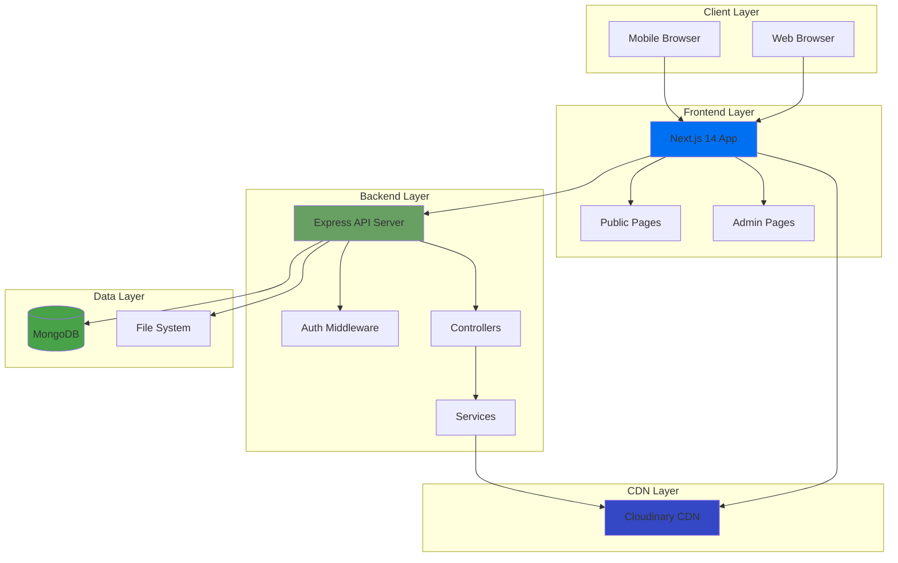
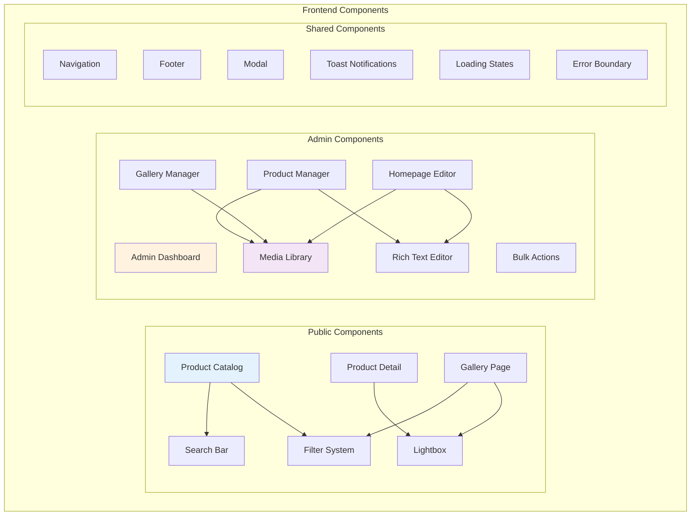

# Design Document: Product and Content Management System

## Overview

This design document specifies the technical architecture and implementation details for the Product and Content Management System for ÉBENOR CRÉATION. The system provides a comprehensive content management solution with public-facing catalog and gallery pages, and a complete admin dashboard for managing products, gallery images, and homepage content.

### System Context

The system extends the existing ÉBENOR CRÉATION platform which includes:
- **Backend**: Express.js with TypeScript, MongoDB with Mongoose, JWT authentication
- **Frontend**: Next.js 14 with App Router, TypeScript, Tailwind CSS
- **Infrastructure**: Cloudinary CDN for media storage, Docker containerization
- **Existing Models**: Product, GalleryImage, HomeContent, AdminUser, Message

### Key Features

1. **Public Product Catalog** - Browsable product catalog with filtering, search, sorting, and pagination
2. **Product Detail Pages** - Rich product pages with image galleries, videos, and specifications
3. **Public Gallery** - Masonry layout gallery with category filtering and lightbox viewing
4. **Admin Dashboard** - Complete CRUD operations for products, gallery, and homepage content
5. **Media Management** - Centralized media library with Cloudinary integration
6. **Rich Content Editing** - WYSIWYG editor for formatted content
7. **Bulk Operations** - Efficient multi-item management capabilities
8. **Analytics Dashboard** - Real-time statistics and insights

### Design Principles

- **Performance First**: Lazy loading, CDN delivery, optimized images, database indexing
- **Security by Default**: Input validation, XSS prevention, CSRF protection, rate limiting
- **Responsive Design**: Mobile-first approach with adaptive layouts
- **Accessibility**: WCAG 2.1 AA compliance with semantic HTML and ARIA labels
- **Developer Experience**: Type-safe APIs, clear separation of concerns, comprehensive error handling

## Architecture

### System Architecture



### Technology Stack

#### Frontend
- **Framework**: Next.js 14 with App Router
- **Language**: TypeScript 5.3+
- **Styling**: Tailwind CSS 3.x
- **State Management**: React Context API + SWR for data fetching
- **Forms**: React Hook Form with Zod validation
- **Rich Text Editor**: TipTap or Lexical
- **Image Handling**: next/image with Cloudinary loader
- **HTTP Client**: Fetch API with custom wrapper

#### Backend
- **Runtime**: Node.js 18+
- **Framework**: Express.js 4.x
- **Language**: TypeScript 5.3+
- **Database**: MongoDB 7.x with Mongoose ODM
- **Authentication**: JWT (jsonwebtoken)
- **File Upload**: Multer + Cloudinary SDK
- **Validation**: express-validator
- **Security**: Helmet, CORS, express-rate-limit
- **Logging**: Winston

#### Infrastructure
- **CDN**: Cloudinary for media storage and delivery
- **Database**: MongoDB Atlas or self-hosted
- **Containerization**: Docker + Docker Compose
- **Environment**: dotenv for configuration

### Component Architecture



### Data Flow Architecture

```mermaid
sequenceDiagram
    participant User
    participant NextJS
    participant API
    participant MongoDB
    participant Cloudinary
    
    Note over User,Cloudinary: Public Product Browsing Flow
    User->>NextJS: Browse /produits
    NextJS->>API: GET /api/products?page=1&category=cuisine
    API->>MongoDB: Query products with filters
    MongoDB-->>API: Return products
    API-->>NextJS: JSON response with products
    NextJS->>Cloudinary: Load product images
    Cloudinary-->>NextJS: Optimized images
    NextJS-->>User: Render product catalog
    
    Note over User,Cloudinary: Admin Product Creation Flow
    User->>NextJS: Create product (admin)
    NextJS->>API: POST /api/admin/products (with JWT)
    API->>API: Validate JWT & permissions
    API->>API: Validate product data
    User->>NextJS: Upload product images
    NextJS->>API: POST /api/admin/upload (multipart)
    API->>Cloudinary: Upload images
    Cloudinary-->>API: Return image URLs
    API->>MongoDB: Save product with image URLs
    MongoDB-->>API: Confirm save
    API-->>NextJS: Success response
    NextJS-->>User: Show success notification
